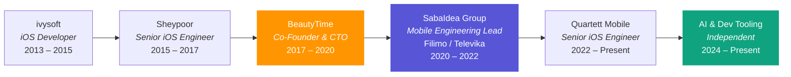
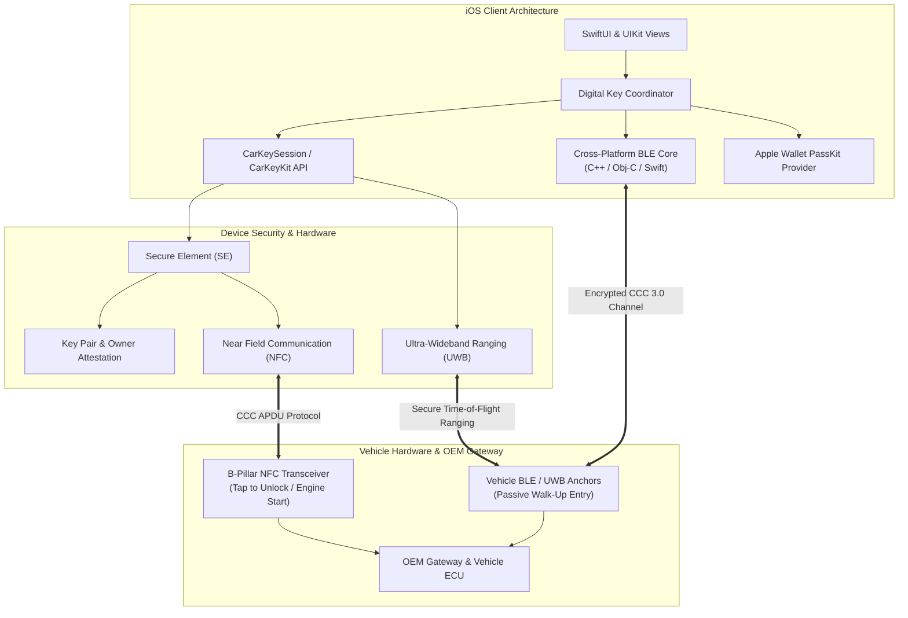

<div align="center">


# Amir Kashani
### **Senior Software Engineer · System Architect · Technical Lead**

Munich, Germany · [kashaniamirabbas@gmail.com](mailto:kashaniamirabbas@gmail.com) · [github.com/aakpro](https://github.com/aakpro)

[](https://maps.google.com/?q=Munich)
[](mailto:kashaniamirabbas@gmail.com)
[](https://github.com/aakpro)

---

### Quick Navigation
[Profile](#profile) · [Experience](#experience) · [Automotive Architecture](#automotive-connectivity-architecture) · [Skills](#skills) · [Projects](#selected-projects) · [Education](#education) · [Awards](#awards) · [Contact](#contact)

---

</div>

> **Senior engineer and technical lead with 10+ years architecting mobile platforms, entertainment streaming systems, and connected-vehicle ecosystems. I decompose hard problems into clear specifications, govern cross-team interface contracts, and accelerate delivery through AI-augmented tooling. Co-founded a company. Built and shipped products used by millions.**

---

## Proven Impact

| **10+ Years** | **Co-Founded a Company** | **Entertainment at Scale** | **Automotive Systems** | **AI-Accelerated Delivery** |
| :---: | :---: | :---: | :---: | :---: |
| System architecture, technical leadership, product ownership | Zero to 9K DAU — product vision, hiring, architecture, go-to-market | Architected Filimo's iOS platform (millions of users, 30% retention lift) | Owned Apple CarKey & CCC 3.0 digital key specifications | Built AI pipelines that cut content labeling and bug triage times by 80%+ |

---

## Profile

I architect systems and govern their boundaries — then build teams that can execute without me. My career spans **entertainment platforms at scale** (Filimo — the Middle East's largest VOD service), **automotive connected mobility** (Apple CarKey, CCC 3.0), **a company I co-founded and scaled** (BeautyTime), and most recently **AI-powered developer tooling**.

I think in specifications, not implementations. I start with the user problem, define interface contracts and architectural constraints, and let those blueprints drive parallel execution across teams. I hire people who will eventually replace me — that's how I know the architecture works.

> [!NOTE]
> **What differentiates me:**
> - **System decomposition:** I break complex domains (vehicle key cryptography, VOD streaming pipelines, multi-platform e-commerce) into bounded modules with explicit contracts — enabling parallel team execution with zero architectural drift.
> - **Entertainment & media depth:** Two years leading mobile engineering for a VOD platform serving millions taught me what most engineers never face: zero-tolerance latency requirements, content licensing constraints that rewrite your roadmap, and product decisions that live or die by watch-time metrics.
> - **AI as engineering leverage:** I don't build AI demos — I build AI pipelines that eliminate toil. Transcription, video analysis, bug triage, codebase knowledge graphs. The pattern is always the same: find the bottleneck, specify the interface, let the model do the commodity work.
> - **Entrepreneurial judgment:** Co-founding a company taught me that every technical decision is a business decision. I think about unit economics, user funnels, and time-to-market — not just code quality.

---

## Career Journey



---

## Experience

### AI-Augmented Engineering & Developer Tooling · **Independent / Open Source**
`2024 – Present` · Munich

Designing and shipping AI pipelines that eliminate engineering toil — from problem specification through deployment. Focus: developer productivity, content automation, and intelligent triage.

- **AI Transcription Pipeline ([noScribe](https://github.com/aakpro/noScribe)):** Architected an end-to-end multi-speaker transcription system (Whisper + pyannote). Defined the speaker-diarization interface contracts and output schema — timestamped, speaker-labeled transcripts consumed by downstream content workflows.
- **Multimodal Video Analysis:** Specified and built video processing pipelines using Qwen models for automated scene classification, content tagging, and metadata extraction. Eliminated manual content labeling from a media workflow — **80%+ reduction in labeling effort**.
- **Codebase Knowledge Graphs ([Graphify](https://github.com/aakpro/graphify)):** Extended a tool that transforms codebases (source, docs, SQL schemas, configs) into queryable knowledge graphs via deterministic AST parsing. No vector store, no embeddings — fully reproducible and auditable.
- **LLM-Powered Bug Triage:** Built a crash analysis pipeline that parses stack traces, correlates with recent commits, and surfaces probable root causes with suggested fixes. **Cut initial triage time from ~30 minutes to under 5.**

---

### Senior iOS Engineer · **Quartett Mobile**
`March 2022 – Present` · Munich · *Automotive OEM Connected Mobility*

Owned the iOS digital car key domain for a major OEM program — from specification through production. The role demands equal parts systems engineering and cross-org alignment: I define interface contracts between app, platform, and vehicle-side systems, then coordinate delivery across engineering, product, design, and vehicle test counterparts.

- **Digital Key System Ownership:** Authored and governed the iOS-side specification for CarKeyKit / CarKey integration — owner pairing flows, Apple Wallet provisioning, key sharing policies, and remote lock/unlock via `CarKeySession`. Defined the boundary contracts between app layer, Secure Element, and vehicle gateway.
- **CCC 3.0 Protocol Integration:** Formulated the technical constraints and integration specifications for CCC Digital Key across NFC (tap-to-unlock), BLE, UWB distance ranging, and Secure Element–backed attestation — coordinating three teams (iOS, firmware, vehicle ECU) against a single specification.
- **Cross-Platform BLE Architecture:** Designed and led the cross-platform BLE stack (C++, Objective-C, Swift) powering keyless connectivity across iOS and Android. Defined the abstraction boundaries that let both platforms share a single C++ core without leaking platform concerns.
- **Quality Governance:** Established automated quality gates, review standards, and testability contracts that removed single-person bottlenecks from delivery. Mentored engineers on architectural reasoning, not just code output.

<details>
<summary><b>Deep Dive: Digital Key Architecture</b></summary>
<br/>

> [!IMPORTANT]
> The Digital Key system orchestrates cryptographic and hardware-level interactions between iOS devices and vehicle transceivers — Secure Element key generation, certificate exchange, CCC 3.0 APDU protocols, BLE + UWB distance ranging, and NFC background polling. The architectural challenge is governing the contracts between four independent systems (iOS app, Secure Element, vehicle NFC transceiver, OEM cloud gateway) while meeting automotive-grade reliability requirements.

</details>

---

### Team Lead of Mobile Engineering · **SabaIdea Group**
*(Filimo · Televika · Zabia)*  
`March 2020 – March 2022` · *Entertainment & Video Streaming*

**Filimo** is one of the largest video-on-demand platforms in the Middle East — think of it as the regional Netflix. Millions of active users, a deep content catalog, and the kind of scale where a bad architectural decision shows up as a revenue loss within hours.

I led mobile engineering across the SabaIdea entertainment group. This was equal parts system architecture, product ownership, and team building — not a "write code and hand it off" role.

- **Platform Re-Architecture:** Formulated the technical specification for a full iOS platform rewrite — decomposing a monolithic legacy app into modularized feature frameworks (Clean Architecture + MVVM). Defined module boundaries, dependency contracts, and API interfaces that enabled two engineers to execute the rewrite in 6 months with **30% improvement in load time and user retention**.
- **Streaming System Design:** Redesigned the video playback pipeline — AVPlayer caching strategy, CDN failover logic, and adaptive bitrate selection. Specified the interface contracts between the player layer, content delivery, and offline download system. Result: smooth playback across inconsistent network conditions and measurably lower buffering rates.
- **Content Discovery & Recommendation UX:** Partnered with product and data teams to specify the mobile surfaces for content recommendation — personalized home feeds, watch-history-driven suggestions, and editorial content placements. Defined the data contracts between mobile clients and the recommendation backend.
- **Product Governance:** Owned the decision boundary between mobile engineering and product. I didn't implement features handed to me — I shaped what we built, negotiated scope and sequencing, and made explicit tradeoffs between technical debt, delivery speed, and business risk.
- **Offline Content & DRM:** Architected the offline download system with DRM compliance, storage management, and license renewal flows. Specified the contracts between content encryption, local storage, and playback authorization.
- **Engineering Organization Design:** Hired, onboarded, and mentored junior engineers with an explicit goal of cultivating the next generation of tech leads. Partnered with leadership to redesign team boundaries — transitioning from functional silos to autonomous product pods where engineering, product, and design collaborated directly.
- **Automated Verification:** Established CI/CD automation and testing contracts that reduced release regression cycles by **40%**. Built analytics instrumentation across the full user funnel — from browse to binge — giving product data-driven visibility into feature performance.

<details>
<summary><b>Deep Dive: VOD Platform Engineering at Scale</b></summary>
<br/>

> [!IMPORTANT]
> Building for entertainment at scale is a different engineering discipline. Millions of users with zero tolerance for buffering. Content licensing constraints that invalidate your roadmap overnight. Product decisions that live or die by engagement metrics measured in watch-minutes, not page views. Every architectural choice — caching policy, CDN selection algorithm, offline sync strategy — has a direct, measurable impact on revenue and retention.

**What this role taught me that most engineering roles don't:**
- How to specify systems where the failure mode is "user leaves and never comes back" — not a retry or an error page.
- How to govern contracts between content delivery, rights management, and client-side playback across wildly inconsistent network conditions.
- How to make product tradeoffs when the data is engagement curves and churn funnels, not JIRA ticket counts.
- How to build a team that owns the product surface, not just the codebase — engineers who think in user journeys, not just API endpoints.

</details>

---

### Co-Founder & CTO · **BeautyTime**
`November 2017 – March 2020` · *E-Commerce & Appointment Scheduling Startup*


I co-founded and ran a company. Product vision, hiring, system architecture, fundraising conversations, sales partnerships, and shipping under impossible deadlines — the full scope of what it takes to go from zero to a live product with paying users.

- **System Specification Under Constraints:** Defined the product architecture and interface contracts for a multi-platform scheduling system (iOS, Android, Web) under a 4-month delivery constraint. The specification had to be simple enough for a small team to execute in parallel without coordination overhead.
- **Zero to 9K DAU:** Shipped *BeautyTime* (consumer scheduling) and *Beautter* (business staff management) across three platforms. Managed the full funnel from acquisition to retention — **9,000+ daily active users** during peak campaigns.
- **Team Architecture:** Built a 6-person organization (engineering, product, marketing, sales) designed for distributed ownership. Every team member owned a product slice end-to-end. My explicit goal was to make the founder non-blocking — the sign of a well-architected team.
- **Business-Driven Engineering:** Every technical decision was a business decision. I learned to prioritize ruthlessly, cut scope that didn't drive retention, and build vendor partnerships alongside the product.

<details>
<summary><b>What Entrepreneurship Taught Me About Engineering</b></summary>
<br/>

> [!NOTE]
> Running a company changed how I think about architecture permanently. The question stopped being "what's the cleanest design?" and became "what ships fastest, retains users, and won't collapse under growth?" I learned that the best specification is the one that lets a small team move fast without stepping on each other — and that's an architectural problem, not a management problem.

</details>

---

### Senior iOS Engineer · **Sheypoor**
`August 2015 – October 2017` · *Leading Classifieds Marketplace (350+ Employees)*

- **Critical Platform Launch:** Architected and shipped Sheypoor iOS v2 in **three months** — the release that reduced user churn and directly supported a major institutional funding round.
- **API & Interface Design:** Co-authored API contracts and UX specifications for v3 alongside product managers and backend teams. Shaped the product direction, not just the implementation.
- **Measurable Impact:** Technical and product contributions drove a **20% lift in user engagement** across the organization.
- **Fast-Tracked to Senior:** Promoted in **12 months** — 16 months ahead of the standard engineering track.

---

### iOS Developer · **ivysoft**
`June 2013 – January 2015`

- **Platform Re-Architecture:** Restructured legacy codebases across two flagship apps — **50% reduction in load times** and modernized UX foundations.
- **Business Model Specification:** Proposed and executed a transition from paid apps to freemium, based on user analytics and review data — **30% increase in downloads and revenue**. Changed the product strategy, not just the code.

---

## Automotive Connectivity Architecture

> [!NOTE]
> Architectural overview of the CCC Digital Key 3.0 & Apple CarKey system I own at Quartett Mobile — showing the interface contracts between iOS client, device security hardware, and vehicle-side systems:



---

## Skills

### System Design & Governance
```
System Architecture · Domain Decomposition · Interface Contract Design · API Specification
Modularization · Performance Profiling · Cross-Team Technical Alignment · Architectural RFCs
```

### Core Technologies
```
Swift · Objective-C · C++ · Python · SwiftUI · UIKit · Combine · Async/Await · GCD
Core Data · SQLite · AVFoundation · StoreKit · REST · GraphQL
```

### Entertainment & Streaming
```
VOD Platform Architecture · AVPlayer Pipeline Design · CDN Failover & ABR
Offline Content Sync · DRM Compliance · Content Recommendation Systems · Engagement Analytics
```

### Automotive & Hardware Protocols
```
Apple CarKeyKit · CCC Digital Key 3.0 · PassKit (Apple Wallet) · NFC
Bluetooth Low Energy (BLE) · Ultra-Wideband (UWB) · Secure Element (SE)
```

### AI & Engineering Leverage
```
AI-Augmented Development (Claude, Cursor, Copilot, Agentic Workflows)
OpenAI Whisper · LLMs (GPT, Qwen, Claude) · pyannote · AST Parsing
AI Pipeline Design · Automated Verification · Prompt-Driven Prototyping
```

### Leadership & Organization Design
```
Company Building · Hiring & Technical Interviewing · 1:1 Mentoring
Team Org Design · Product Roadmapping · Stakeholder Management · KPI-Driven Decisions
```

---

## Selected Projects

| Project | Domain | Role | Impact |
|:---|:---|:---:|:---|
| **Filimo / Televika** | Entertainment / VOD | Mobile Lead | Re-architected iOS platform for millions of users; 30% retention lift; streaming, DRM, recommendations |
| **[noScribe](https://github.com/aakpro/noScribe)** | AI Transcription | Architect | End-to-end Whisper + pyannote pipeline; multi-speaker timestamped output |
| **Qwen Video** | AI Video Analysis | Architect | Multimodal scene classification and metadata extraction; 80%+ labeling reduction |
| **[Graphify](https://github.com/aakpro/graphify)** | AI Dev Tools | Builder | Codebase → queryable knowledge graph via AST parsing, no vector store |
| **Recordium** | Audio Recording | iOS | Featured by Apple, TNW, Guardian; Top 10 Business in 110 countries |
| **BeautyTime** | E-Commerce | Co-Founder & CTO | Zero to 9K DAU across 3 platforms in 4 months |
| **Quartett OEM Key** | Automotive | iOS System Owner | Apple CarKeyKit, CCC 3.0 specification, Secure Element, cross-platform BLE |
| **Rahavard365** | Financial Markets | iOS | Tehran Stock Exchange real-time data; millions of users |
| **Digipay** | Fintech | iOS | Digital wallet for Digikala |
| **Pacatio** | Fintech | iOS | Payment processing (USA) |
| **Foxdoor** | Fintech | iOS | Mobile payments (Europe) |
| **MusicMa** | Music Streaming | iOS | High-fidelity streaming client |
| **TripeMa** | Travel | iOS | Lodging & tourism marketplace |
| **Chanteh Group** | Education | Instructor | iOS development curriculum in Swift |

---

## Education

- **M.Sc. in E-Commerce** — *Iran University of Science and Technology (2015 – 2018)*
  - **Thesis:** *Assessing business value of big data analysis in firms*
- **B.Sc. in Software Engineering** — *Shahid Beheshti University (2008 – 2013)*
  - **Focus:** Object-oriented analysis, architectural design, and software systems

---

## Awards

> [!IMPORTANT]
> **Best Solution for Audio Recording in Smartphones — Recordium (Apple App Store, 2013)**
> - Featured globally by Apple, *The Next Web*, *The Guardian*, *The Telegraph*, and major tech publications.
> - **Top 10 Business Apps in 110 countries.**

- **Selected Scientific Association Award — Harkat Festival (2011)**
  - Head of the Scientific Association of Computer Engineering and Informatics Society.

---

## Community

- **E-Commerce Laboratory (ECLab)** — *IUST*: Research papers, seminars, and big data technology presentations.
- **SM-Art Robotic Group**: Autonomous algorithms for Small Size League (RoboCup).

---

## Languages

- **English:** Professional working proficiency
- **Persian:** Native

---

## Contact

- **Email:** [kashaniamirabbas@gmail.com](mailto:kashaniamirabbas@gmail.com)
- **GitHub:** [@aakpro](https://github.com/aakpro)
- **Location:** Munich, Germany
