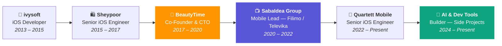
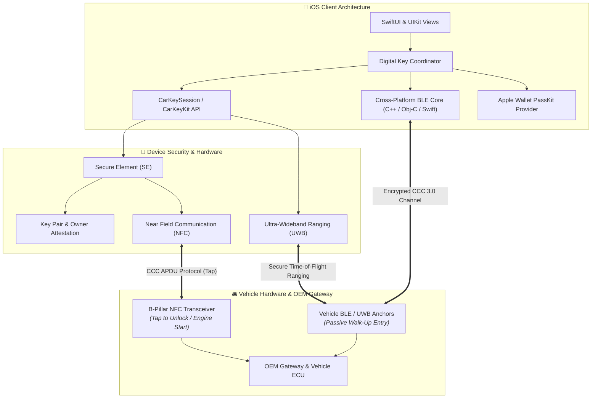

<div align="center">


# 🚀 Amir Kashani
### **Senior Software Engineer · Technical Lead · Entrepreneur**

Munich, Germany · [kashaniamirabbas@gmail.com](mailto:kashaniamirabbas@gmail.com) · [github.com/aakpro](https://github.com/aakpro)

[](https://maps.google.com/?q=Munich)
[](mailto:kashaniamirabbas@gmail.com)
[](https://github.com/aakpro)

---

### Quick Navigation
[Profile](#-profile) • [Impact](#-proven-impact--metrics) • [Experience](#-experience) • [Automotive Architecture](#-automotive-connectivity-architecture) • [Tech Stack](#️-technical-skills--toolbox) • [Projects](#-selected-projects--freelance) • [Awards](#-awards--achievements) • [Contact](#-connect--contact)

---

</div>

> [!TIP]
> **Executive Summary:** Entrepreneur-engineer who builds products, not just features. 10+ years shipping mobile apps at scale, leading teams, co-founding a company, and — most recently — building AI-powered developer tools and automation pipelines. I think in products, ship in sprints, and hire people who will replace me.

---

## 📊 Proven Impact & Metrics

| 🏆 **10+ Years** | 🚀 **Co-Founded a Company** | 🤖 **AI Tool Builder** | 🚗 **Automotive Lead** | 📈 **30% Performance Boost** | 🌍 **Top 10 Global App** |
| :---: | :---: | :---: | :---: | :---: | :---: |
| Hands-on engineering, leadership & product thinking | Built BeautyTime from zero to 9K DAU across 3 platforms in 4 months | Shipping AI transcription, video analysis & dev automation tools | Owned Apple CarKey & CCC 3.0 digital key systems | Retention & load-time optimization at scale (Filimo, millions of users) | Featured by Apple in 110 countries (Recordium) |

---

## ⚡ Profile

Product-minded engineer and entrepreneur with **10+ years** building mobile products, scaling engineering teams, and shipping AI-powered tools. I've co-founded a company, led mobile engineering for one of the largest entertainment platforms in the Middle East, and currently build at the intersection of **AI, automation, and developer tooling**.

> [!NOTE]
> **What I Bring:**
> - **Entrepreneurial DNA:** Co-founded and scaled BeautyTime from idea to 9K DAU — hiring, product strategy, sales, and engineering. I think about unit economics and user funnels, not only architecture diagrams.
> - **AI & Automation:** Built and shipped AI-powered tools — an end-to-end transcription pipeline (Whisper + pyannote), multimodal video analysis (Qwen), LLM-powered bug triage, and codebase knowledge graph tooling.
> - **Entertainment at Scale:** Led mobile engineering for **Filimo** (Iran's largest VOD platform, millions of users) — streaming infrastructure, recommendation UX, content delivery, and the full product lifecycle.
> - **Product Orientation:** I start with the user problem, work backward to the architecture. I've owned product decisions, not just implementation, at every company I've worked at.
> - **Multiplying Others:** I hire, mentor, and build teams that don't need me. Bias toward written decisions, async communication, and distributed ownership.

---

## 🗺️ Career Journey



---

## 💼 Experience

### AI Tools & Developer Automation · **Independent / Open Source**
`2024 – Present` · Munich, Germany

Building and shipping AI-powered tools focused on developer productivity and content automation. All projects are hands-on: architecture, implementation, and deployment.

- **AI Audio Transcription ([noScribe](https://github.com/aakpro/noScribe)):** Built an end-to-end transcription pipeline using OpenAI Whisper with pyannote speaker diarization. Handles multi-speaker audio, outputs timestamped speaker-labeled transcripts. Used for meeting notes and content production workflows.
- **AI Video Analysis:** Built video processing pipelines with Qwen multimodal models — automated scene classification, content tagging, and metadata extraction from raw video files. Reduced manual content labeling effort for a media workflow.
- **Codebase Knowledge Graphs ([Graphify](https://github.com/aakpro/graphify)):** Extended a tool that turns codebases (source, docs, SQL schemas, configs) into queryable knowledge graphs using deterministic AST parsing — no vector store, no embeddings, fully reproducible.
- **AI Bug Triage:** Built an LLM-powered crash analysis tool that parses stack traces, correlates with recent commits, and surfaces probable root causes with suggested fixes. Cut initial triage time on a personal project from ~30 minutes to under 5.

---

### Senior iOS Engineer · **Quartett Mobile**
`March 2022 – Present` · Munich, Germany · *Automotive OEM Connected Mobility*


- **Owned iOS Digital Car Key:** End-to-end ownership of CarKeyKit / CarKey, owner pairing, Apple Wallet provisioning, key sharing, and remote lock/unlock (`CarKeySession`).
- **CCC Digital Key Ecosystem:** Integrated CCC Digital Key specification with NFC (tap-to-unlock / start), BLE, Apple Wallet passes, entitlements, and Secure Element–backed keys — coordinating app, platform, and vehicle-side constraints.
- **Cross-Platform BLE Stack:** Led a cross-platform BLE stack (C++, Objective-C, Swift) powering vehicle connectivity and keyless features across iOS and Android.
- **Cross-Team Alignment & Delivery:** Drove priorities and technical direction with distributed product and design partners; resolved org boundaries and unblocked delivery when the work stalled.
- **Mentorship & Quality Culture:** Mentored engineers and instituted modern quality practices (comprehensive code reviews, testability, maintainability) enabling continuous delivery without single-person gates.

<details>
<summary><b>🔍 Deep Dive: Automotive Connectivity & Digital Key Architecture</b></summary>
<br/>

> [!IMPORTANT]
> The Digital Key implementation orchestrates complex cryptographic and hardware-level interactions between iOS devices and vehicle transceivers.

- **Security & Attestation:** Secure Element (SE) key generation, certificate exchange, and owner authorization.
- **Keyless Access:** Low-latency BLE scanning, RSSI smoothing, and Ultra-Wideband (UWB) distance ranging for passive walk-up unlocking.
- **Tap-to-Unlock:** Background NFC polling matching CCC 3.0 standardized APDU communication protocols.
- **Vehicle Diagnostics:** Synchronized telemetry and lock-state feedback to the cloud via MQTT/REST endpoints.

</details>

---

### Team Lead of Mobile Engineering · **SabaIdea Group**
*(Filimo · Televika · Zabia)*  
`March 2020 – March 2022` · *Entertainment & Video Streaming — Millions of Users*


**Filimo** is one of the largest video-on-demand platforms in the Middle East — think of it as the regional Netflix. I led mobile engineering across multiple apps in the SabaIdea entertainment group.

- **Full iOS Rewrite:** Spearheaded a complete iOS rewrite with two engineers in 6 months — **30% improvement in load time and user retention**. Redesigned the streaming architecture, content discovery UX, and offline download system.
- **Product–Engineering Bridge:** Owned the decision interface between mobile and product. I didn't just implement features — I shaped what we built, when we shipped, and what we cut. Scope negotiation, sequencing, and technical debt tradeoffs were my daily work.
- **Recommendation & Content UX:** Worked closely with product and data teams on content recommendation surfaces, personalized home feeds, and watch-history-driven suggestions.
- **Streaming Infrastructure:** Optimized AVPlayer caching, CDN selection algorithms, and adaptive bitrate streaming for smooth playback across inconsistent network conditions.
- **Built the Team, Not Just the Code:** Hired, onboarded, and mentored junior engineers with an explicit goal of growing future leads. Partnered with leadership to redesign org boundaries so product, engineering, and design could work as autonomous pods.

<details>
<summary><b>🎬 Deep Dive: Entertainment Platform Scale</b></summary>
<br/>

> [!IMPORTANT]
> Leading mobile engineering for a major entertainment platform taught me things you can't learn building internal tools: millions of users with zero tolerance for buffering, content licensing constraints that change your roadmap overnight, and product decisions that live or die by engagement metrics.

- Transitioned legacy codebase into Clean Architecture + MVVM with modularized feature frameworks.
- Implemented CI/CD automation to reduce release regression cycles by 40%.
- Designed offline content sync with DRM compliance and storage management.
- Built analytics instrumentation across the entire user funnel — from browse to binge.

</details>

---

### Co-Founder & CTO · **BeautyTime**
`November 2017 – March 2020` · *E-Commerce & Appointment Scheduling Startup*


This wasn't a side project — I co-founded and ran a company. I did everything a startup CTO does: product vision, hiring, architecture, fundraising conversations, sales partnerships, and shipping under impossible deadlines.

- **Zero to Product:** Defined the product vision, designed the initial architecture, and shipped *BeautyTime* (consumer scheduling) and *Beautter* (business staff management) across **three platforms in four months**.
- **Built a Company, Not Just an App:** Led a 6-person team spanning engineering, product, marketing, and sales. Set priorities, shipping cadence, and growth targets. Made hard calls on what to build and what to kill.
- **Scaled to 9K+ DAU:** Launched an e-commerce scheduling platform that hit **9,000+ daily visitors** during high-demand campaigns. Managed the full funnel from acquisition to retention.
- **Designed for Autonomy:** Built a culture where team members owned slices of the product end-to-end. My explicit goal was to make myself replaceable — the sign of a well-built organization.

<details>
<summary><b>💡 What Entrepreneurship Taught Me</b></summary>
<br/>

> [!NOTE]
> Running a company changed how I think about engineering forever. I stopped asking "what's the cleanest architecture?" and started asking "what ships fastest, retains users, and doesn't collapse under growth?" Every technical decision became a business decision.

- Learned to prioritize ruthlessly — you can't afford technical perfection when you have 4 months of runway.
- Built vendor partnerships and sales pipelines alongside the product.
- Managed the emotional and operational complexity of leading a team where failure means everyone loses their jobs, not just a missed sprint goal.

</details>

---

### iOS Engineer · **Sheypoor**
`August 2015 – October 2017` · *Leading Classifieds Marketplace (350+ Employees)*


- **Critical v2 Launch:** Shipped Sheypoor iOS v2 in **three months**, reducing churn and directly supporting a major funding round.
- **Fast-Tracked to Senior:** Promoted in **12 months** — 16 months ahead of the standard track.
- **Product Thinking, Early:** Co-designed API contracts and UX patterns for v3 alongside product managers. I didn't wait for specs — I shaped them.
- **Company-Wide Impact:** Contributions drove a **20% lift in engagement** across a ~350-person organization.

---

### iOS Developer · **ivysoft**
`June 2013 – January 2015`


- **50% Load Time Reduction:** Re-architected legacy code across two flagship production apps.
- **Business Model Innovation:** Proposed and executed a shift from paid apps to freemium — **30% more downloads and revenue**. Used customer reviews and analytics to change product strategy, not just the codebase.

---

---

## 🚗 Automotive Connectivity Architecture

> [!NOTE]
> Architectural overview of the CCC Digital Key 3.0 & Apple CarKey ecosystem led at Quartett Mobile:



---

## 🛠️ Technical Skills & Toolbox

### 📱 Mobile & iOS
```
Swift • Objective-C • SwiftUI • UIKit • Combine • Async/Await • GCD
Core Data • SQLite • URLSession • AVFoundation • StoreKit • Instruments
```

### 🤖 AI, ML & Automation
```
Python • OpenAI Whisper • LLMs (GPT, Qwen, Claude) • pyannote • AST Parsing
AI-Powered Dev Tools • Multimodal Video Analysis • Automated Bug Triage
```

### 🚗 Automotive & Hardware
```
Apple CarKeyKit • CCC Digital Key 3.0 • PassKit (Apple Wallet) • NFC
Bluetooth Low Energy (BLE) • Ultra-Wideband (UWB) • Secure Element (SE)
```

### 🏛️ Architecture & Product
```
Clean Architecture • MVVM • MVC • SOLID • Protocol-Oriented Programming
Dependency Injection • RxSwift • TDD • Modular Frameworks • Product Strategy
```

### 👥 Leadership & Entrepreneurship
```
Company Building • Hiring & Interviewing • 1:1 Mentoring • Team Org Design
Product Roadmapping • Stakeholder Management • KPI-Driven Decisions • Async RFCs
```

### 🔧 Tools & Platforms
```
Xcode • Git (GitHub, GitLab, Bitbucket) • CI/CD • Fastlane
REST • GraphQL • C++ • C# • Figma • Zeplin • Sketch
```

---

## 📂 Selected Projects & Freelance

| Project | Domain | Role | Highlights |
|:---|:---|:---:|:---|
| **[noScribe](https://github.com/aakpro/noScribe)** | AI Transcription | Builder | End-to-end Whisper + pyannote pipeline; multi-speaker timestamped output |
| **Qwen Video** | AI Video Analysis | Builder | Multimodal scene classification, content tagging, metadata extraction |
| **[Graphify](https://github.com/aakpro/graphify)** | AI Dev Tools | Builder | Codebase → queryable knowledge graph via AST parsing, no vector store |
| **Recordium** | Audio Recording | iOS | 🏆 Featured by Apple, TNW, Guardian; Top 10 in 110 countries |
| **BeautyTime** | E-Commerce | Co-Founder | Zero to 9K DAU across 3 platforms in 4 months |
| **Filimo / Televika** | Entertainment / VOD | Mobile Lead | Full rewrite, 30% retention boost, millions of users |
| **Quartett OEM Key** | Automotive | iOS Engineer | Apple CarKeyKit, CCC 3.0, Secure Element |
| **Rahavard365** | Financial Markets | iOS | Tehran Stock Exchange; millions of users |
| **Digipay** | Fintech | iOS | Digital wallet for Digikala |
| **Pacatio** | Fintech | iOS | Payment processing (USA) |
| **Foxdoor** | Fintech | iOS | Mobile payments (Europe) |
| **MusicMa** | Music Streaming | iOS | High-fidelity streaming client |
| **TripeMa** | Travel | iOS | Lodging & tourism marketplace |
| **Chanteh Group** | Education | Instructor | iOS development curriculum in Swift |

---

## 🎓 Education

- **M.Sc. in E-Commerce** — *Iran University of Science and Technology (2015 – 2018)*
  - **Thesis:** *Assessing business value of big data analysis in firms*
- **B.Sc. in Software Engineering** — *Shahid Beheshti University (2008 – 2013)*
  - **Focus:** *Object-oriented analysis, architectural design, and software systems*

---

## 🏆 Awards & Achievements

> [!IMPORTANT]
> **Best Solution for Audio Recording in Smartphones — Recordium (Apple App Store, 2013)**
> - Officially featured globally by Apple, *The Next Web (TNW)*, *The Guardian*, *The Telegraph*, and major tech publications.
> - Ranked in the **Top 10 Business Apps in 110 countries**.

- **Selected Scientific Association Award — Harkat Festival (2011)**
  - Head of the Scientific Association of Computer Engineering and Informatics Society.

---

## 🤝 Volunteering & Community

- **Member, E-Commerce Laboratory (ECLab)** — *IUST*: Academic research papers, seminars, and big data technology presentations.
- **Robotics Developer, SM-Art Robotic Group**: Autonomous algorithms for Small Size League (RoboCup).

---

## 🌐 Languages

- **English:** Professional Working Proficiency
- **Persian:** Native / Bilingual Proficiency

---

## 📬 Connect & Contact

- **Email:** [kashaniamirabbas@gmail.com](mailto:kashaniamirabbas@gmail.com)
- **GitHub:** [@aakpro](https://github.com/aakpro)
- **Location:** Munich, Germany

<div align="center">
  <sub>Built with ❤️ • Hosted on GitHub • Optimized for Dark & Light Mode</sub>
</div>
