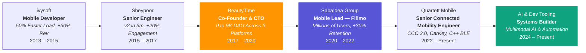
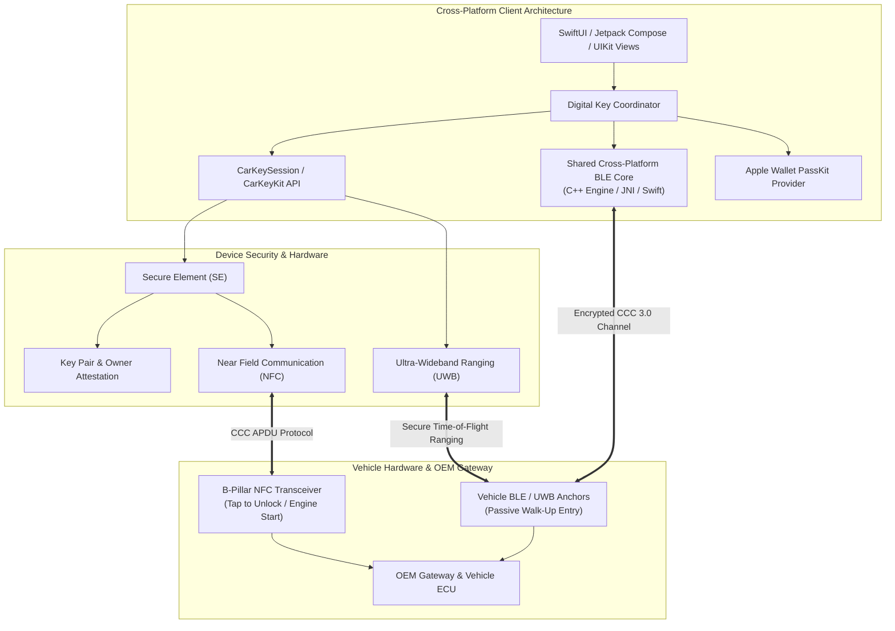

<div align="center">


# Amir Kashani
### **Cross-Platform Technical Lead · System Architect · Mobile & AI Engineer**

Munich, Germany · [kashaniamirabbas@gmail.com](mailto:kashaniamirabbas@gmail.com) · [github.com/aakpro](https://github.com/aakpro)

[](https://maps.google.com/?q=Munich)
[](mailto:kashaniamirabbas@gmail.com)
[](https://github.com/aakpro)

---

### Quick Navigation
[Profile](#profile) · [Impact](#proven-impact) · [Experience](#experience) · [Automotive Architecture](#automotive-connectivity-architecture) · [Skills](#skills) · [Projects](#selected-projects) · [Education](#education) · [Awards](#awards) · [Contact](#contact)

---

</div>

> **High-impact technical lead and system architect with 10+ years driving cross-platform engineering (iOS, Android, Web, C++ shared cores) across high-scale entertainment (millions of users), automotive connected mobility (CCC 3.0, Apple CarKey), and venture-backed startups. Proven record of delivering 30%+ performance and retention gains, cutting regression cycles by 40%, and launching 0-to-1 products to millions through architectural governance, cross-functional leadership, and AI-accelerated workflows.**

---

## Proven Impact

| **10+ Years Cross-Platform** | **0-to-1 Startup Scaled** | **Entertainment at Scale** | **Connected Vehicle Systems** | **AI-Accelerated Velocity** |
| :---: | :---: | :---: | :---: | :---: |
| Systems architecture, cross-platform leadership, product execution | Scaled BeautyTime to 9K DAU across 3 platforms in 4 months | Re-architected Filimo for millions of users; +30% retention | Delivered CCC 3.0 & Apple CarKey across iOS & shared C++ core | Slashed content labeling by 80% & bug triage time from 30m to <5m |

---

## Profile

I architect scalable systems, govern interface boundaries, and build high-velocity engineering organizations. My background is inherently cross-platform — operating across **mobile (iOS/Android), web, shared C++ cores, embedded hardware interfaces, and distributed backends**.

Throughout my career, I have operated at the intersection of **technical depth and business leverage**:
- **Cross-Platform Engineering DNA:** I do not operate in single-platform silos. Whether harmonizing vehicle connectivity across iOS and Android with a shared C++ BLE core, synchronizing multi-platform releases (Web, iOS, Android) as a startup CTO, or leading mobile engineering for a top-tier VOD platform, I design modular systems with explicit interface contracts that empower parallel execution.
- **High-Scale Entertainment (VOD):** Led mobile engineering for Filimo (millions of active subscribers), solving zero-tolerance playback latency, adaptive bitrate delivery, DRM licensing, and recommendation UX under erratic network conditions.
- **Automotive & Hardware Integration:** Engineered mission-critical vehicle-to-device connectivity within a tier-1 OEM automotive program, delivering CCC 3.0 Digital Key specifications, Apple CarKeyKit, and Secure Element cryptography.
- **Entrepreneurial Execution:** Co-founded and grew a tech venture from zero to market leadership, translating tight runway into aggressive prioritization, high product velocity, and measurable user retention.
- **AI as an Engineering Lever:** Focused on practical tooling that eliminates development toil — multimodal content classification, intelligent crash triage, and automated media pipelines.

---

## Career Journey



---

## Experience

### AI-Augmented Engineering & Developer Tooling · **Independent / Open Source**
`2024 – Present` · Munich

Building and deploying targeted AI pipelines and local-first software that eliminate engineering friction and automate media workflows:

- **Automated Video Classification Pipeline:** Eliminated **80%+ of manual labeling effort** for media workflows by building an automated multimodal video classification engine (Qwen), orchestrating frame extraction, scene understanding, and structured metadata tagging.
- **MacSpyCam Security System:** Architected and shipped MacSpyCam, a privacy-first macOS security tool with local-only processing, real-time motion detection heuristics, configurable event thresholds, and low-latency automated alerting dispatches.
- **Intelligent Bug Triage Pipeline:** Reduced crash triage turnaround by **83% (from ~30 minutes to under 5)** by building an LLM-powered crash analyzer that maps stack traces and error signatures directly to commit history to synthesize root-cause hypotheses and fix recommendations.
- **AI Media Transcription Workflows:** Accelerated transcript delivery across interviews and content pipelines by evaluating, integrating, and orchestrating Whisper + pyannote multi-speaker diarization pipelines with custom output schemas.
- **Codebase Knowledge Graphs:** Accelerated multi-repo comprehension and architectural reviews by leveraging deterministic AST parsing tools (Graphify) to navigate unfamiliar codebases and dependency trees without vector database overhead.

---

### Senior Connected Mobility Engineer · **Quartett Mobile**
`March 2022 – Present` · Munich · *Automotive OEM Connected Mobility Program*

Delivering mission-critical digital vehicle key and connectivity architectures within a major automotive OEM program, collaborating across cross-platform teams (iOS, Android, vehicle firmware, ECU, and cloud services):

- **Delivered Mission-Critical Digital Car Key Systems:** Engineered the iOS implementation of CarKeyKit and Apple CarKey, ensuring seamless owner pairing, Apple Wallet pass provisioning, cryptographic key sharing, and remote vehicle telematics via `CarKeySession`.
- **Integrated CCC 3.0 Standard Protocols:** Implemented sub-second vehicle access protocols matching Car Connectivity Consortium (CCC 3.0) standards across NFC (tap-to-unlock / engine start), BLE proximity detection, UWB distance ranging, and Secure Element (SE) certificate exchange in close alignment with vehicle ECU and firmware squads.
- **Unified Cross-Platform Vehicle Connectivity:** Co-developed and maintained the shared cross-platform C++ BLE connectivity core deployed across both iOS and Android, eliminating platform protocol divergence and halving ongoing protocol maintenance overhead.
- **Resolved Cross-Org Delivery Blockers:** Drove cross-functional alignment between mobile squads, hardware test counterparts, and distributed product/design stakeholders, establishing strict interface boundaries that unblocked stalled delivery milestones.
- **Instituted High-Rigor Engineering Practices:** Championed automated quality gates, contract testing, and structured code reviews across the mobile organization, removing single-person deployment gates and elevating team-wide delivery reliability.

<details>
<summary><b>Deep Dive: Automotive Connectivity & Digital Key Architecture</b></summary>
<br/>

> [!IMPORTANT]
> The Digital Key ecosystem orchestrates cryptographic and hardware-level interactions between personal devices and vehicle transceivers. Success requires coordinating four distinct systems — the mobile presentation layer, Secure Element (SE) key attestation, the vehicle B-pillar/interior transceivers, and the OEM cloud gateway — under strict latency and automotive safety standards.

- **Security & Attestation:** Secure Element (SE) key generation, certificate exchange, and CCC 3.0 APDU communication.
- **Passive Entry:** Low-latency BLE scanning, RSSI smoothing, and Ultra-Wideband (UWB) distance ranging for passive walk-up unlocking.
- **Tap-to-Unlock:** Background NFC polling matching CCC 3.0 standardized APDU communication protocols.
- **Vehicle Diagnostics:** Synchronized telemetry and lock-state feedback to the cloud via MQTT/REST endpoints.

</details>

---

### Team Lead of Mobile Engineering · **SabaIdea Group**
*(Filimo · Televika · Zabia)*  
`March 2020 – March 2022` · *Entertainment & High-Scale Video Streaming*

Led cross-platform mobile engineering for **Filimo** (the premier video-on-demand platform in the Middle East, serving millions of active subscribers) along with international streaming services Televika and Zabia:

- **Delivered 30% Lift in Retention & Load Performance:** Spearheaded the ground-up architectural rewrite of Filimo's mobile client into modular Clean Architecture + MVVM frameworks with only 2 engineers in 6 months, dramatically boosting playback reliability and subscriber retention.
- **Eliminated Streaming Stalls & Buffering:** Re-engineered the video playback infrastructure with optimized AVPlayer caching, dynamic CDN failover logic, and adaptive bitrate (ABR) streaming, maintaining seamless playback across erratic and low-bandwidth network environments.
- **Optimized Content Discovery & Viewing Sessions:** Partnered with product and data science squads to design and ship high-converting recommendation surfaces, personalized home feeds, and client-side watch-history sync that drove measurable increases in daily watch time.
- **Governed Multi-Squad Interface Boundaries:** Acted as the chief technical decision interface between engineering and product leadership — shaping product roadmaps, negotiating feature scope, managing sequencing, and preventing architectural drift across mobile clients.
- **Secured Studio-Grade Offline DRM Playback:** Architected the complete offline download and storage subsystem with strict DRM license renewal compliance, encrypted local caching, and proactive storage quota management.
- **Slashed Release Regression Cycles by 40%:** Established modern CI/CD automation pipelines, automated test suites, and standardized release gating criteria, drastically accelerating shipping cadence while cutting production bug escapes.
- **Cultivated Autonomous Engineering Pods:** Hired, onboarded, and coached junior and mid-level engineers into independent technical leads. Redesigned cross-department collaboration, breaking down silos to unite engineering, product, and UI/UX in autonomous squads.

<details>
<summary><b>Deep Dive: High-Scale VOD Platform Architecture</b></summary>
<br/>

> [!IMPORTANT]
> Delivering VOD at scale is a merciless domain: millions of concurrent users with zero patience for buffering, sudden traffic spikes during nationwide premieres, and stringent studio rights compliance. Every millisecond of player initialization and every caching decision directly impacts subscription retention and revenue.

- **Architectural Decomposition:** Decoupled legacy monolithic codebase into isolated feature frameworks with strict interface boundaries, allowing independent compilation and parallel squad development.
- **Resilient Content Delivery:** Engineered multi-CDN routing logic that dynamically switches stream segments on high latency or packet loss without interrupting playback.
- **Funnel & Telemetry Instrumentation:** Implemented granular event instrumentation across the complete user journey (browse &rarr; preview &rarr; stream &rarr; complete), giving product teams instant data-driven feedback on feature releases.

</details>

---

### Co-Founder & CTO · **BeautyTime**
`November 2017 – March 2020` · *E-Commerce & Multi-Platform Scheduling Startup*


Co-founded, architected, and scaled an e-commerce appointment marketplace, owning company strategy, product roadmaps, technical systems, and organizational execution from day zero:

- **Built & Shipped 3 Platforms in 4 Months:** Architected, specified, and launched two complementary products across **Web, iOS, and Android** within 4 months — consumer booking engine *BeautyTime* and B2B staff scheduling suite *Beautter*.
- **Scaled Growth to 9,000+ Peak Daily Active Users:** Designed scalable backends and resilient client apps that handled rapid customer acquisition spikes during high-volume promotional campaigns with zero downtime.
- **Formed an Autonomous 6-Person Organization:** Hired and led a 6-person cross-functional team spanning engineering, product, marketing, and sales. Structured workflows around distributed ownership so product lines could iterate without founder-level micromanagement.
- **Ruthless Commercial Prioritization:** Guided the venture through capital constraints by continually aligning technical architecture with business KPIs, eliminating vanity scope, and establishing key commercial vendor partnerships.

<details>
<summary><b>What Venture Leadership Taught Me About Systems</b></summary>
<br/>

> [!NOTE]
> Founding and running a company permanently cemented my focus on outcomes over activities. Clean code only matters if it accelerates time-to-market, delights users, and scales unit economics. I evaluate every architectural tradeoff through the lens of business survival, team velocity, and user retention.

</details>

---

### Senior Engineer · **Sheypoor**
`August 2015 – October 2017` · *Leading Classifieds Marketplace (350+ Employees)*

- **Secured Major Institutional Funding Round:** Architected and deployed Sheypoor iOS v2 in **3 months**, turning around user churn and providing the core mobile metrics needed to close a pivotal venture financing round.
- **Achieved Fast-Track Promotion in 12 Months:** Promoted to Senior Developer in 12 months (16 months ahead of standard company trajectory) based on exceptional cross-platform execution and technical leadership.
- **Boosted Platform Engagement by 20%:** Partnered with web, Android, and backend teams across a 350-person company to design responsive, scalable v3 API contracts that significantly enhanced user engagement.

---

### Mobile Developer · **ivysoft**
`June 2013 – January 2015`

- **Cut Launch Latency by 50%:** Systematically refactored and eliminated legacy bottlenecks across two flagship production mobile apps, doubling application responsiveness and usability.
- **Drove 30% Revenue & Download Growth:** Spearheaded the data-driven migration from paid upfront downloads to an in-app freemium model by mining user reviews and funnel drop-off analytics, transforming product monetization.

---

## Automotive Connectivity Architecture

> [!NOTE]
> Architectural overview of the CCC Digital Key 3.0 & Apple CarKey ecosystem at Quartett Mobile — illustrating the boundary contracts between the mobile layer, hardware security modules, and vehicle gateway:



---

## Skills

### System Design & Cross-Platform Governance
```
Cross-Platform Architecture · System Decomposition · Interface Contract Design · API Governance
Domain-Driven Design (DDD) · Modular Feature Frameworks · Performance Profiling · Architectural RFCs
```

### Core Technologies & Languages
```
Swift · Objective-C · C++ · Python · Kotlin / Android Interop · SwiftUI · UIKit
Combine · Async/Await · GCD · SQLite · Core Data · AVFoundation · REST · GraphQL
```

### Entertainment & Streaming at Scale
```
VOD Platform Architecture · Adaptive Bitrate (ABR) · AVPlayer Engine Design · CDN Failover
Offline DRM Synchronization · Content Discovery & Recommendation UX · Funnel Telemetry
```

### Automotive & Hardware Systems
```
Apple CarKeyKit · CCC Digital Key 3.0 · PassKit (Apple Wallet) · NFC Transceivers
Bluetooth Low Energy (BLE) · Ultra-Wideband (UWB) Ranging · Secure Element (SE) Attestation
```

### AI Operations & Developer Velocity
```
AI-Augmented Development (Claude, Cursor, Copilot, Agentic Workflows) · Multimodal AI (Qwen)
OpenAI Whisper · pyannote Diarization · AST Parsing & Knowledge Graphs · Automated Bug Triage
```

### Leadership & Venture Execution
```
0-to-1 Company Building · Technical Hiring & Interviewing · Cross-Functional Team Leadership
1:1 Mentoring · Product Roadmapping · KPI & Metrics Alignment · Async Decision-Making
```

---

## Selected Projects

| Project | Domain | Role | Key Achievements |
|:---|:---|:---:|:---|
| **Filimo / Televika** | Entertainment / VOD | Mobile Lead | Re-architected streaming platform for millions of users; **+30% retention**; sub-second playback |
| **BeautyTime & Beautter** | E-Commerce | Co-Founder & CTO | Shipped **3 platforms in 4 months**; scaled to **9K+ DAU**; end-to-end venture execution |
| **Quartett OEM Key** | Automotive Mobility | Senior Engineer | Delivered Apple CarKey & CCC 3.0 protocols; **co-developed unified C++ BLE core** across iOS & Android |
| **Qwen Video Engine** | Multimodal AI | Builder | **Slashed manual video tagging by 80%+** via automated scene classification pipeline |
| **MacSpyCam** | AI / Security | Builder | Privacy-first macOS security monitor with local motion detection and zero-latency alerting |
| **[noScribe](https://github.com/aakpro/noScribe)** | AI Audio Pipeline | Evaluator & Integrator | Integrated multi-speaker Whisper + pyannote diarization into production media workflows |
| **[Graphify](https://github.com/aakpro/graphify)** | AI Dev Tooling | Power User | Accelerated multi-repo comprehension via deterministic AST-based knowledge graph extraction |
| **Recordium** | Audio Recording | Mobile Developer | 🏆 **Apple App Store Best of Year**; Featured in 110 countries; Top 10 Business worldwide |
| **Sheypoor iOS v2** | Marketplace | Senior Engineer | **Shipped v2 in 3 months**, closing major institutional funding round; **+20% engagement** |
| **Rahavard365** | Financial Markets | Mobile Developer | Real-time stock exchange data processing engine serving millions of active investors |
| **Digipay** | Fintech & Payments | Mobile Developer | High-throughput digital checkout and wallet companion for Digikala e-commerce |
| **Pacatio & Foxdoor** | Fintech | Mobile Developer | Digital payment processing applications across USA and European banking rails |
| **MusicMa** | Music Streaming | Mobile Developer | High-fidelity music streaming application with offline caching and audio pipelines |
| **Chanteh Group** | Tech Education | Lead Instructor | Authored and instructed comprehensive modern software development curriculum in Swift |

---

## Education

- **M.Sc. in E-Commerce** — *Iran University of Science and Technology (2015 – 2018)*
  - **Thesis:** *Assessing business value of big data analysis in firms*
- **B.Sc. in Software Engineering** — *Shahid Beheshti University (2008 – 2013)*
  - **Focus:** Object-oriented analysis, architectural design, and software systems

---

## Awards

> [!IMPORTANT]
> **Best Solution for Audio Recording in Smartphones — Recordium (Apple App Store, 2013)**
> - Officially featured globally by Apple, *The Next Web*, *The Guardian*, *The Telegraph*, and international tech press.
> - **Top 10 Business Apps in 110 countries.**

- **Selected Scientific Association Award — Harkat Festival (2011)**
  - Head of the Scientific Association of Computer Engineering and Informatics Society.

---

## Community & Academic Work

- **E-Commerce Laboratory (ECLab)** — *IUST*: Academic research papers, seminars, and big data technology presentations.
- **SM-Art Robotic Group**: Autonomous algorithms for Small Size League (RoboCup).

---

## Languages

- **English:** Professional working proficiency
- **Persian:** Native proficiency

---

## Contact

- **Email:** [kashaniamirabbas@gmail.com](mailto:kashaniamirabbas@gmail.com)
- **GitHub:** [@aakpro](https://github.com/aakpro)
- **Location:** Munich, Germany

<div align="center">
  <sub>Built with ❤️ • Hosted on GitHub • Optimized for Dark & Light Mode</sub>
</div>
