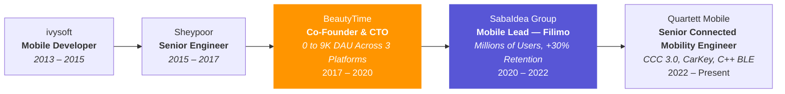
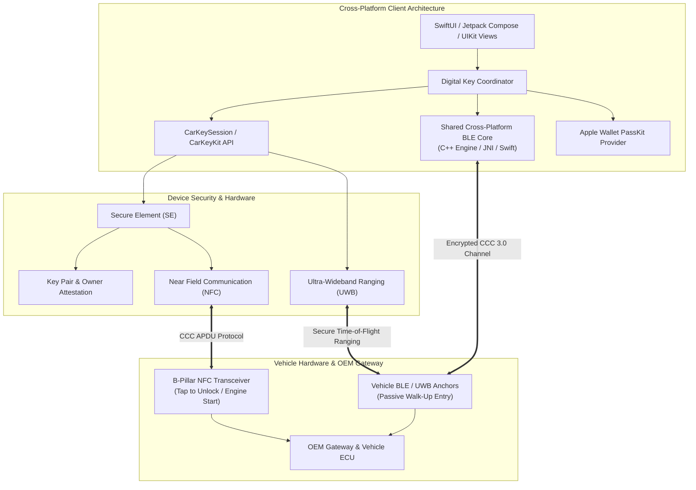

<div align="center">


# Amir Kashani
### **Cross-Platform Mobile Engineering Lead · Systems Architect**

Munich, Germany · [kashaniamirabbas@gmail.com](mailto:kashaniamirabbas@gmail.com) · [github.com/aakpro](https://github.com/aakpro)

[](https://maps.google.com/?q=Munich)
[](mailto:kashaniamirabbas@gmail.com)
[](https://github.com/aakpro)

---

### Quick Navigation
[Profile](#profile) · [Impact](#proven-impact) · [Experience](#experience) · [Independent Work](#independent-projects-and-ai-tooling) · [Automotive Architecture](#automotive-connectivity-architecture) · [Skills](#skills) · [Projects](#selected-projects) · [Education](#education) · [Awards](#awards) · [Contact](#contact)

---

</div>

> **Cross-platform mobile engineering lead with 10+ years spanning iOS, Android, Web, and shared C++ cores. Led mobile engineering for Filimo, a leading Middle East video-on-demand platform serving millions of subscribers, and previously co-founded a startup that shipped three platforms in four months. Currently a senior engineer on a connected-vehicle program building CCC 3.0 Digital Key and Apple CarKey integrations.**

---

## Proven Impact

| **10+ Years Cross-Platform Leadership** | **0-to-1 Startup, Scaled to 9K DAU** | **High-Scale Entertainment: +30% Retention** |
| :---: | :---: | :---: |
| Mobile, web, and C++ systems architecture across entertainment, automotive, and startups | Co-founded BeautyTime; shipped Web, iOS, and Android in 4 months | Led Filimo's mobile architecture rewrite for millions of subscribers |

---

## Profile

I architect scalable systems, govern interface boundaries, and build high-velocity engineering teams. My background is cross-platform — operating across **mobile (iOS/Android), web, shared C++ cores, and embedded hardware interfaces**.

- **Cross-Platform Engineering:** Whether synchronizing multi-platform releases (Web, iOS, Android) as a startup CTO, leading mobile engineering for a top VOD platform, or contributing to a shared C++ BLE core for vehicle connectivity, I design modular systems with explicit interface contracts that let teams work in parallel.
- **High-Scale Entertainment (VOD):** Led mobile engineering for Filimo (millions of active subscribers), addressing playback latency, adaptive bitrate delivery, DRM licensing, and recommendation UX under variable network conditions.
- **Automotive & Hardware Integration:** Work on vehicle-to-device connectivity as part of a connected-mobility engineering team, integrating CCC 3.0 Digital Key specifications and Apple CarKey.
- **Entrepreneurial Execution:** Co-founded and grew a startup from zero to a working multi-platform product under tight runway constraints.
- **AI as an Engineering Lever:** In my own time, I build tooling that removes development toil — media classification pipelines, crash triage assistance, and automated transcription workflows (see [Independent Work](#independent-projects-and-ai-tooling)).

---

## Career Journey



*Since 2024, I've also been building independent AI tooling projects alongside this role — see [Independent Projects & AI Tooling](#independent-projects-and-ai-tooling).*

---

## Experience

### Senior Connected Mobility Engineer · **Quartett Mobile**
`March 2022 – Present` · Munich · *Connected Vehicle & Digital Key Systems*

Delivering digital vehicle key and connectivity systems as part of a cross-platform automotive engineering team, collaborating across iOS, Android, vehicle firmware, ECU, and cloud services:

- **Delivered Digital Car Key Systems:** Integrated Apple's CarKeyKit framework to support Apple CarKey, handling owner pairing, Apple Wallet pass provisioning, cryptographic key sharing, and vehicle telematics via `CarKeySession`.
- **Integrated CCC 3.0 Standard Protocols:** Implemented vehicle access protocols matching Car Connectivity Consortium (CCC 3.0) standards across NFC (tap-to-unlock / engine start), BLE proximity detection, UWB distance ranging, and Secure Element (SE) certificate exchange, working closely with vehicle ECU and firmware teams.
- **Unified Cross-Platform Vehicle Connectivity:** Co-developed and maintained a shared cross-platform C++ BLE connectivity core deployed across both iOS and Android, removing protocol divergence and duplicate maintenance work between platforms.
- **Resolved Cross-Org Delivery Blockers:** Drove alignment between mobile squads, hardware test counterparts, and distributed product/design stakeholders, establishing clearer interface boundaries that unblocked stalled delivery milestones.
- **Instituted Higher-Rigor Engineering Practices:** Championed automated quality gates, contract testing, and structured code reviews across the mobile team, removing single-person deployment gates.

---

### Team Lead of Mobile Engineering · **SabaIdea Group**
*(Filimo · Televika · Zabia)*  
`March 2020 – March 2022` · *Entertainment & High-Scale Video Streaming*

Led cross-platform mobile engineering for **Filimo** (a leading video-on-demand platform in the Middle East, serving millions of active subscribers) along with international streaming services Televika and Zabia, delivering a **30% lift in retention and load performance** through a phased architecture rewrite:

- **Modularized the Mobile Architecture:** Led the rewrite of Filimo's mobile client into a modular Clean Architecture + MVVM codebase, decoupling the legacy monolith into isolated feature frameworks that enabled independent compilation and parallel squad development.
- **Reduced Streaming Stalls & Buffering:** Re-engineered video playback infrastructure with optimized AVPlayer caching, CDN failover logic, and adaptive bitrate (ABR) streaming to hold up under erratic, low-bandwidth network conditions.
- **Improved Content Discovery & Watch Time:** Partnered with product and data science to design recommendation surfaces, personalized home feeds, and client-side watch-history sync.
- **Governed Multi-Squad Interface Boundaries:** Acted as the primary technical liaison between engineering and product leadership — shaping roadmaps, negotiating feature scope, and preventing architectural drift across mobile clients.
- **Delivered Offline DRM Playback:** Built the offline download and storage subsystem with DRM license renewal compliance, encrypted local caching, and storage quota management.
- **Cut Release Regression Cycles by 40%:** Established CI/CD automation, automated test suites, and standardized release gating criteria, accelerating shipping cadence while cutting production bug escapes.
- **Grew the Engineering Team:** Hired, onboarded, and coached junior and mid-level engineers into independent technical leads, restructuring collaboration across engineering, product, and UI/UX.

---

### Co-Founder & CTO · **BeautyTime**
`November 2017 – March 2020` · *E-Commerce & Multi-Platform Scheduling Startup*


Co-founded, architected, and scaled an e-commerce appointment marketplace, owning strategy, product, technical systems, and organizational execution from day zero:

- **Built & Shipped 3 Platforms in 4 Months:** Architected and launched two complementary products across **Web, iOS, and Android** within 4 months — consumer booking engine *BeautyTime* and B2B staff scheduling suite *Beautter*.
- **Scaled to 9,000+ Peak Daily Active Users:** Designed backends and client apps that handled rapid acquisition spikes during promotional campaigns without downtime.
- **Built a 6-Person Cross-Functional Team:** Hired and led engineering, product, marketing, and sales, structuring workflows so product lines could iterate without founder-level micromanagement.
- **Managed Growth Under Capital Constraints:** Continually aligned technical architecture with business KPIs, cut vanity scope, and established key commercial vendor partnerships.

---

### Senior Engineer · **Sheypoor**
`August 2015 – October 2017` · *Leading Classifieds Marketplace (350+ Employees)*

- **Shipped iOS v2 Ahead of a Funding Round:** Architected and deployed Sheypoor iOS v2 in **3 months**, turning around user churn and providing mobile metrics that supported a venture financing round.
- **Promoted to Senior Developer in 12 Months:** Ahead of the company's standard trajectory, based on cross-platform execution and technical leadership.
- **Boosted Platform Engagement by 20%:** Partnered with web, Android, and backend teams to design v3 API contracts that improved user engagement.

---

### Recordium — Independent iOS App · 2013

🏆 **Apple App Store Best of Year** · Featured in 110 countries · Top 10 Business Apps worldwide · Covered by *The Guardian*, *The Telegraph*, and *The Next Web*

Built and shipped an audio recording app for iOS, independently of my employment at the time.

---

### Mobile Developer · **ivysoft**
`June 2013 – January 2015`

- **Cut Launch Latency:** Refactored and eliminated legacy bottlenecks across two flagship production mobile apps, improving application responsiveness.
- **Drove Revenue & Download Growth:** Led the data-driven migration from paid upfront downloads to an in-app freemium model by mining user reviews and funnel drop-off analytics.
- Also shipped mobile work for Rahavard365 (real-time stock market data), Digipay and Pacatio/Foxdoor (digital payments), and MusicMa (music streaming) during this period.

---

## Independent Projects and AI Tooling

*Personal projects and open-source exploration alongside my primary role, 2024 – Present. Not employment.*

- **Automated Video Classification Pipeline:** Cut manual labeling effort by roughly **80%** for media workflows by building a multimodal video classification pipeline (Qwen) that orchestrates frame extraction, scene understanding, and structured metadata tagging.
- **MacSpyCam Security System:** Built MacSpyCam, a privacy-first macOS security tool with local-only processing, motion detection heuristics, configurable event thresholds, and low-latency alerting.
- **Intelligent Bug Triage Pipeline:** Cut typical crash-triage turnaround from around 30 minutes to under 5 by building an LLM-powered crash analyzer that maps stack traces and error signatures to commit history to suggest root causes and fixes.
- **AI Media Transcription Workflows:** Evaluated and integrated Whisper + pyannote multi-speaker diarization pipelines (building on [noScribe](https://github.com/kaixxx/noScribe)) with custom output schemas to speed up transcript delivery for interviews and content pipelines.
- **Codebase Knowledge Graphs:** Used deterministic AST parsing tools ([Graphify](https://github.com/Graphify-Labs/graphify)) to navigate unfamiliar codebases and dependency trees without vector database overhead, speeding up multi-repo comprehension.

---

## Automotive Connectivity Architecture

> [!NOTE]
> Reference architecture for the CCC Digital Key 3.0 & Apple CarKey ecosystem — illustrating the boundary contracts between the mobile layer, hardware security modules, and vehicle gateway. This is a generic representation of the kind of automotive digital-key system I work on professionally, not a specific client program.



---

## Skills

### System Design & Cross-Platform Governance
```
Cross-Platform Architecture · System Decomposition · Interface Contract Design · API Governance
Domain-Driven Design (DDD) · Modular Feature Frameworks · Performance Profiling · Architectural RFCs
```

### Core Technologies & Languages
```
Swift · Objective-C · C++ · Python · Kotlin / Android Interop · SwiftUI · UIKit
Combine · Async/Await · GCD · SQLite · Core Data · AVFoundation · REST · GraphQL
```

### Entertainment & Streaming at Scale
```
VOD Platform Architecture · Adaptive Bitrate (ABR) · AVPlayer Engine Design · CDN Failover
Offline DRM Synchronization · Content Discovery & Recommendation UX · Funnel Telemetry
```

### Automotive & Hardware Systems
```
Apple CarKeyKit · CCC Digital Key 3.0 · PassKit (Apple Wallet) · NFC Transceivers
Bluetooth Low Energy (BLE) · Ultra-Wideband (UWB) Ranging · Secure Element (SE) Attestation
```

### AI Operations & Developer Velocity
```
AI-Augmented Development (Claude, Cursor, Copilot, Agentic Workflows) · Multimodal AI (Qwen)
OpenAI Whisper · pyannote Diarization · AST Parsing & Knowledge Graphs · Automated Bug Triage
```

### Leadership & Venture Execution
```
0-to-1 Company Building · Technical Hiring & Interviewing · Cross-Functional Team Leadership
1:1 Mentoring · Product Roadmapping · KPI & Metrics Alignment · Async Decision-Making
```

---

## Selected Projects

| Project | Domain | Role | Key Achievements |
|:---|:---|:---:|:---|
| **Filimo / Televika** | Entertainment / VOD | Mobile Lead (2020–2022) | Re-architected streaming platform for millions of users; **+30% retention** |
| **BeautyTime & Beautter** | E-Commerce | Co-Founder & CTO (2017–2020) | Shipped **3 platforms in 4 months**; scaled to **9K+ DAU** |
| **Quartett Digital Key** | Automotive Mobility | Senior Engineer (2022–Present) | Apple CarKey & CCC 3.0 integration; co-developed shared C++ BLE core across iOS & Android |
| **Qwen Video Engine** | Multimodal AI | Builder (2024–Present) | Cut manual video tagging effort by roughly **80%** |
| **MacSpyCam** | AI / Security | Builder (2024–Present) | Privacy-first macOS security monitor with local motion detection and low-latency alerting |
| **Recordium** | Audio Recording | Independent (2013) | 🏆 **Apple App Store Best of Year**; featured in 110 countries; Top 10 Business worldwide |
| **Sheypoor iOS v2** | Marketplace | Senior Engineer (2015–2017) | Shipped v2 in **3 months** ahead of a funding round; **+20% engagement** |

---

## Education

- **M.Sc. in E-Commerce** — *Iran University of Science and Technology (2015 – 2018)*
  - **Thesis:** *Assessing business value of big data analysis in firms*
- **B.Sc. in Software Engineering** — *Shahid Beheshti University (2008 – 2013)*
  - **Focus:** Object-oriented analysis, architectural design, and software systems

---

## Awards

> [!IMPORTANT]
> **Best Solution for Audio Recording in Smartphones — Recordium (Apple App Store, 2013)**
> - Officially featured globally by Apple, *The Next Web*, *The Guardian*, and *The Telegraph*.
> - **Top 10 Business Apps in 110 countries.**

- **Selected Scientific Association Award — Harkat Festival (2011)**
  - Head of the Scientific Association of Computer Engineering and Informatics Society.

---

## Community & Academic Work

- **E-Commerce Laboratory (ECLab)** — *IUST*: Academic research papers, seminars, and big data technology presentations.
- **SM-Art Robotic Group**: Autonomous algorithms for Small Size League (RoboCup).
- **Chanteh Group**: Authored and taught a software development curriculum in Swift.

---

## Languages

- **English:** Professional working proficiency
- **Persian:** Native proficiency

---

## Contact

- **Email:** [kashaniamirabbas@gmail.com](mailto:kashaniamirabbas@gmail.com)
- **GitHub:** [@aakpro](https://github.com/aakpro)
- **Location:** Munich, Germany

<div align="center">
  <sub>Built with ❤️ • Hosted on GitHub • Optimized for Dark & Light Mode</sub>
</div>
